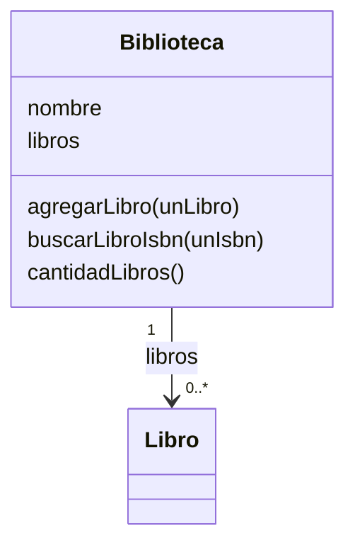

# Helper 4 — Biblioteca: una clase que administra objetos

Fuente: [4-POO-ClaseBiblioteca.pdf](../material/4-POO-ClaseBiblioteca.pdf), pp. 3–13. Prerrequisito: [clase Libro](03-clase-libro-helper.md). Complemento: [colecciones](05-colecciones-helper.md).

## La idea central

`Biblioteca` conoce su `nombre` y mantiene una colección `libros`. Cada elemento es un objeto `Libro`, con estado y mensajes propios. La biblioteca administra el conjunto; cada libro responde consultas sobre sí mismo.



Diagrama didáctico propuesto: muestra el vínculo sin decidir una dependencia de ciclo de vida que la consigna no establece.

## Receta de implementación, pp. 3–10

1. Declarar `nombre libros` como variables de instancia.
2. Crear la biblioteca mediante `crearBiblioNom:` del lado de clase.
3. En `iniBiblioNom:`, asignar el nombre e inicializar `libros := OrderedCollection new`.
4. Implementar consultas y operaciones delegando en la colección.
5. Probar una biblioteca vacía y luego agregar dos libros distintos.

| Mensaje de Biblioteca | Mensaje a la colección |
| --- | --- |
| `agregarLibro:` | `add:` |
| `eliminarLibro:` | `remove:`; definir respuesta si falta |
| `existeLibro:` | `includes:` |
| `esVacia` | `isEmpty` |
| `cantidadLibros` | `size` |
| `recuperarLibro:` | `at:` con posición válida |

`existeLibro:` recibe un **objeto**; `buscarLibroIsbn:` compara un **dato del objeto**. No son búsquedas equivalentes. Además, `todosLosLibros` devuelve la colección interna en el material: modificarla desde la aplicación también modifica el estado de la biblioteca. Una mejora propuesta es ofrecer operaciones específicas o devolver una copia de la colección cuando corresponda.

## Búsqueda y actividad 4, pp. 11–13

Método de instancia propuesto, equivalente a la búsqueda con `do:` del PDF:

```smalltalk
buscarLibroIsbn: unIsbn
    ^libros detect: [:lib | lib verIsbn = unIsbn] ifNone: [nil]
```

Para recuperar el ISBN 235 si está disponible:

```smalltalk
| encontrado |
encontrado := b buscarLibroIsbn: '235'.
encontrado notNil ifTrue: [
    encontrado verEstado = false ifTrue: [
        Transcript show: encontrado verTitulo]].
```

Se usa `'235'` porque la aplicación de la p. 6 captura ISBN como texto. Si se elige otro tipo, debe ser consistente al cargar y buscar. La búsqueda por ISBN no filtra por préstamo: esa condición se comprueba después.

Para eliminar por ISBN, buscar primero, comprobar `notNil` y enviar `b eliminarLibro: encontrado`. Una baja individual no necesita recorrer y borrar simultáneamente.

Para varias bajas, una alternativa propuesta es seleccionar los candidatos y recorrer esa colección separada al eliminarlos de la biblioteca. La p. 13 propone `whileTrue:`: al borrar por posición, no avanzar el índice, porque el elemento siguiente ocupa el lugar liberado.

## Erratas y cuidados

- P. 6: se usa `lib` sin declararlo entre las temporales; `l` y `lib` son variables diferentes.
- P. 12: la segunda búsqueda agrega `esta := false`, sin necesitar esa variable. La primera versión con retorno al encontrar y `^nil` al finalizar es suficiente.
- P. 13: el problema es modificar la estructura de la colección recorrida; cambiar el estado de un libro durante `do:` es otra operación.
- Los inicializadores pueden terminar con `^self` para explicitar el retorno. En un método Smalltalk sin retorno explícito se devuelve el receptor; la falta de `^self` no es por sí sola una errata.

## Controles propuestos

- Biblioteca vacía: cantidad 0 y búsqueda devuelve `nil`.
- Dos libros: recuperar posiciones 1 y 2; no usar índice 0.
- ISBN existente, inexistente y libro prestado.
- Baja de dos candidatos consecutivos sin saltar el segundo.
- Dos bibliotecas: agregar en una no modifica la colección de la otra.

## Repaso: cinco preguntas

1. ¿Por qué inicializar `libros`? **Para enviarle mensajes a una colección y no a `nil`.**
2. ¿Qué devuelve `detect:ifNone:`? **El primer objeto que cumple o el resultado del bloque de ausencia.**
3. ¿Por qué comprobar `notNil`? **La búsqueda puede no encontrar el libro.**
4. ¿Dónde está el estado de préstamo? **En cada Libro.**
5. ¿Por qué no borrar dentro del mismo recorrido? **La eliminación cambia las posiciones y el tamaño que se están recorriendo.**

Ejemplos y resultados esperados para estudio; no ejecutados en Dolphin.
